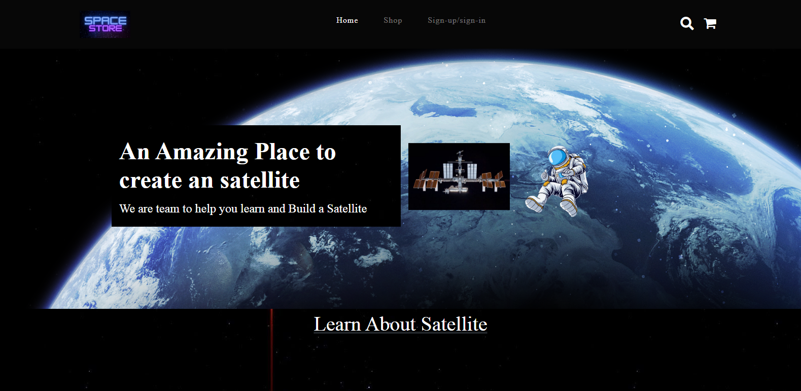
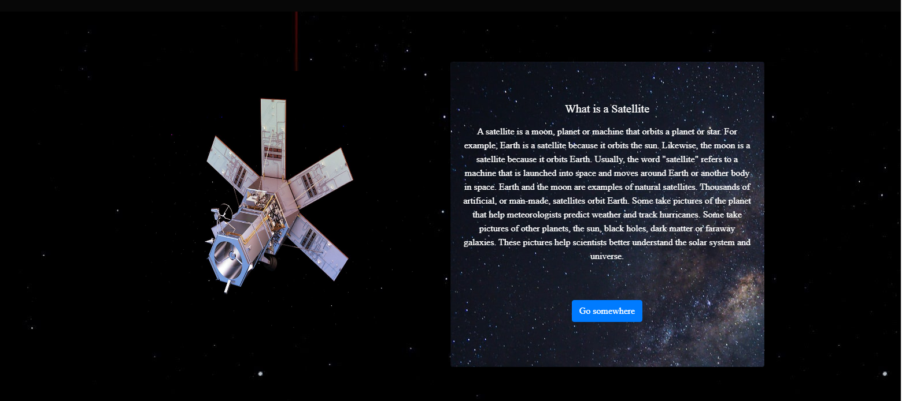
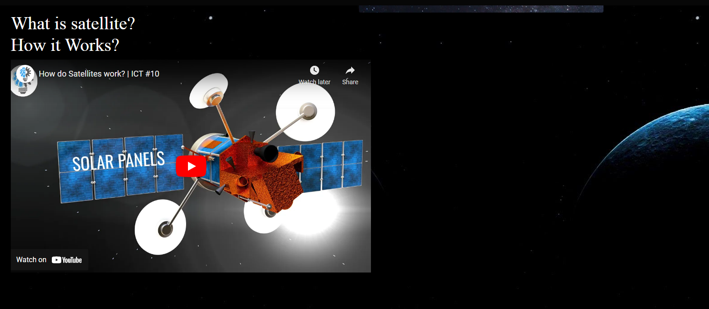
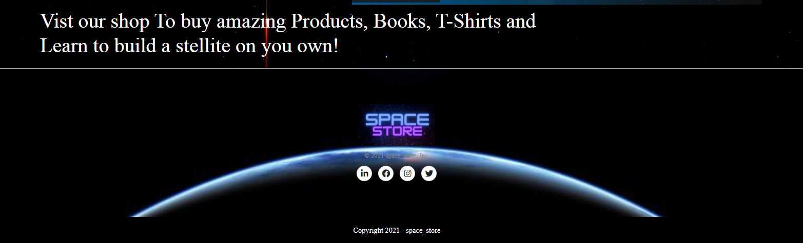
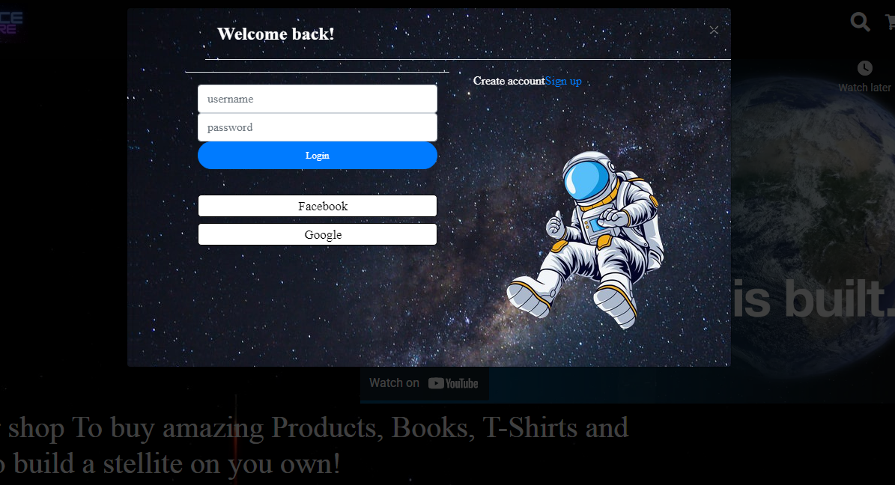
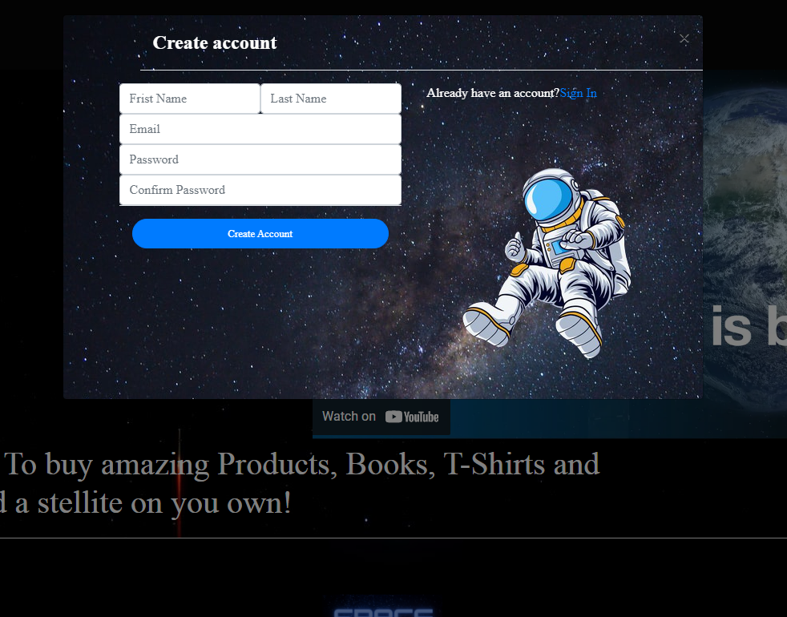
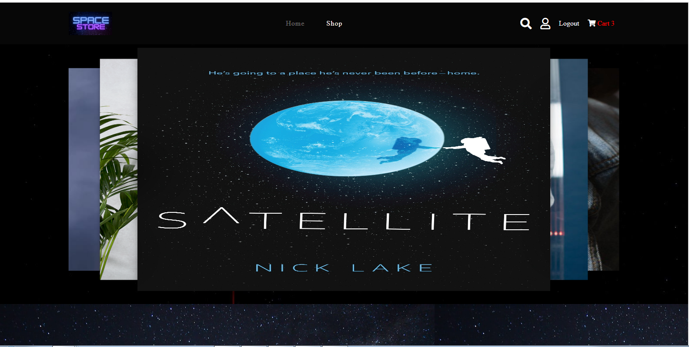
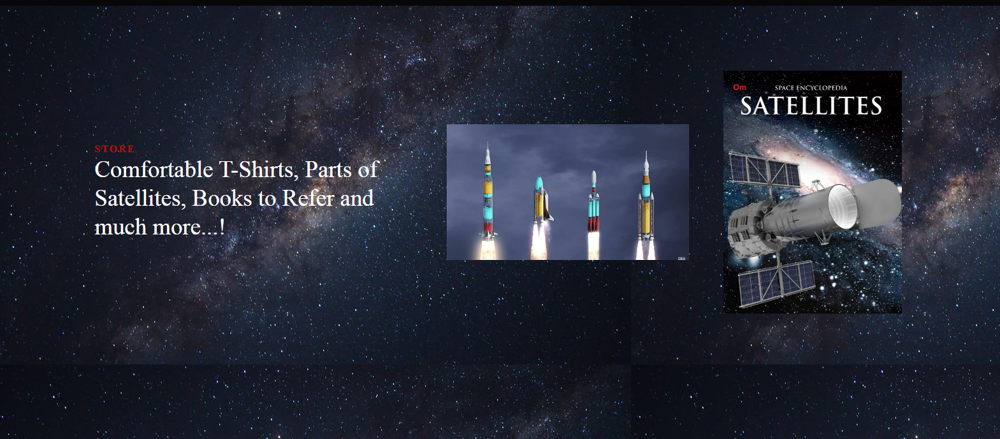
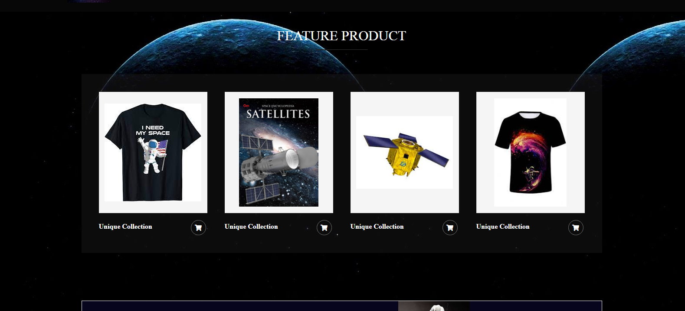

# Website-Development
Web Development problem statement and rule book

Please visit this website!
Website Link - https://stupefied-noether-c9c672.netlify.app/home

For Design - HTML, CSS, Javascript 
For Animation - Aos and Javascript 
For backend-connectivity for login page- used Mysql Workbench for Database and Node.js For Connectivity
 

<b>Navigation Bar</b>
It contains Logo which I Design using Canva. 
shop - To browse Items 
Signup/Signin - for user signin 
Cart- To buy the product

<b>Home Page</b>
Given Animation for the images using javascript

Then Added Information About Satellite to understand the work of satellite. 
Here I have used Aos effect.

I Believe That Videos are more Effective and Interesting than reading the Information so I have added 2 Youtube videos 
This Would be helpfull for users to understand the devices or parts which are used to make a satellite.

Now this is a Footer.

Signin/signup

popup effect

<b>Shop page</b>
I have used 3-d Carousel Effect for viewing the products we have.

used some animation effect to give a small overview about the products, books we have.

And Added Featured Products.

